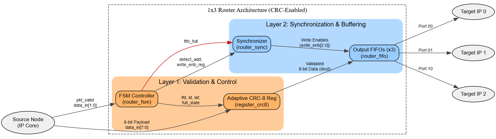
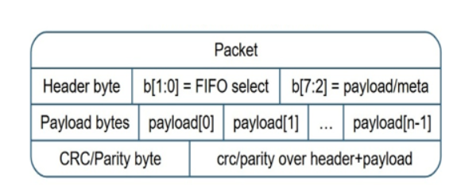
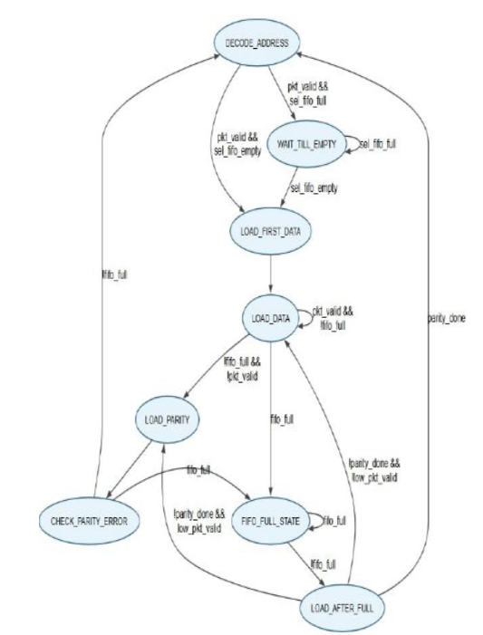
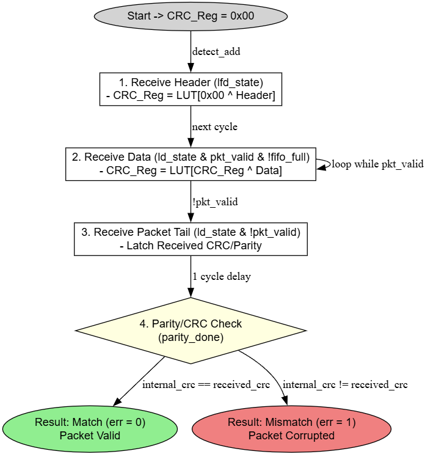
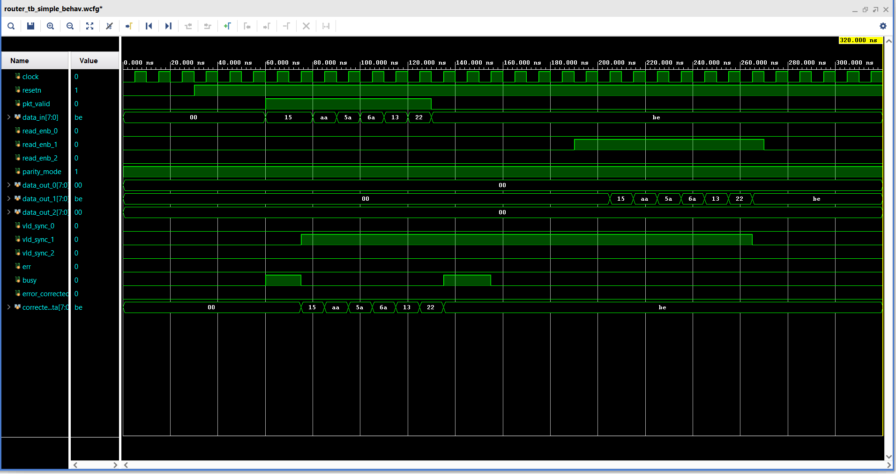

# Reliable 1x3 NoC Router with Dual-Mode Data Integrity

## 📌 Overview
This project implements a high-performance **1x3 Network-on-Chip (NoC) Router** designed for reliable data transmission using **dual-mode data integrity (CRC + Parity)**.

The router efficiently routes packets from a single input to one of three output ports using FIFO buffering, FSM-based control, and synchronized data handling.

---

## 🧠 Key Features
- ✅ 1x3 NoC Router Architecture
- ✅ Dual-mode error detection (CRC + Parity)
- ✅ FIFO-based buffering for smooth data flow
- ✅ FSM-controlled packet processing
- ✅ Channel selection using synchronization logic
- ✅ Modular and scalable SystemVerilog design
- ✅ Handles busy conditions and valid signaling

---

## 🏗️ Architecture
The design consists of the following modules:

- **router_top.sv** → Top-level integration  
- **router_fsm.sv** → Control logic (FSM)  
- **router_fifo.sv** → Data buffering  
- **router_register.sv** → Data storage and forwarding  
- **router_sync.sv** → Channel selection & synchronization  

> *High-level architectural block diagram of the 1x3 NoC Router.*

👉 *Refer `router_top.sv` for complete design integration*

---

## 📦 Packet Format
Data is transmitted using a structured packet format to ensure correct routing and payload integrity.

> *Structure of the data packet including header, payload, and parity/CRC bytes.*

---

## 🔄 Working Flow
1. Packet enters through input interface  
2. FSM detects and processes packet  
3. Data stored temporarily in register/FIFO  
4. Synchronization logic selects output channel  
5. Packet transmitted to correct output port  
6. CRC/Parity ensures data integrity  

### FSM Control Logic
The finite state machine governs the state transitions for packet reception, buffering, and transmission.

> *State transition diagram for the router control logic.*

### Error Detection (CRC)
The router uses robust error detection mechanisms to validate packets before successful transmission.

> *Flowchart detailing the CRC error detection and validation process.*

---

## 🧪 Testbench
- Testbench file: **router_tb.sv**
- Simulates packet transmission across different output channels
- Verifies:
  - Data routing correctness
  - Valid signal generation
  - Busy handling
  - Error detection mechanism

---

## 📊 Simulation Waveform

> The waveform demonstrates correct packet routing, FIFO behavior, valid signals, and output data flow across different channels.

---

## 🛠️ Tools & Technologies
- **Language:** SystemVerilog  
- **Simulation:** ModelSim / QuestaSim / Vivado Simulator  

---

## 📈 Applications
- Network-on-Chip (NoC) communication  
- ASIC/SoC design  
- High-speed data routing systems  

---

## 💡 Future Improvements
- Support for larger NoC topologies (e.g., mesh)
- Advanced error correction (ECC)
- Performance optimization for latency

---

## 👨‍💻 Author
**Amaan Sami**  
Electronics & Communication Engineering  
MANIT Bhopal
